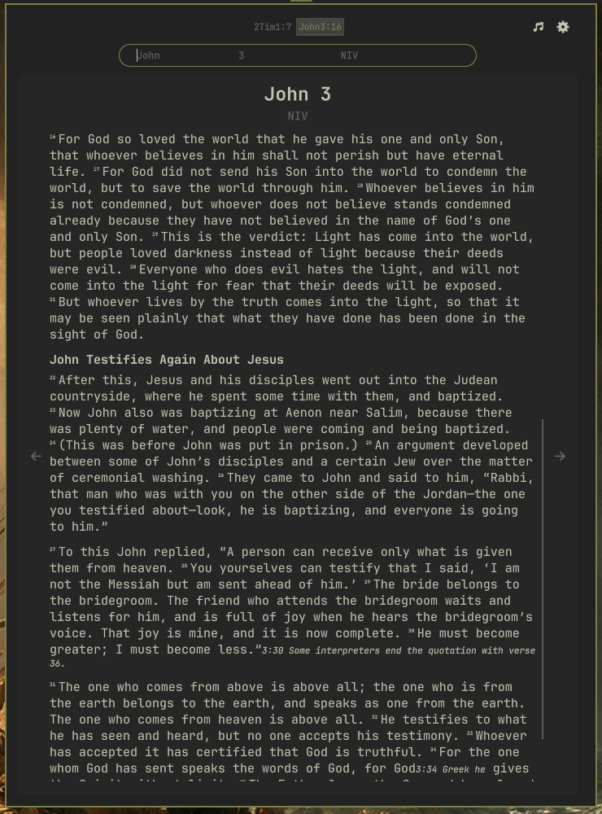
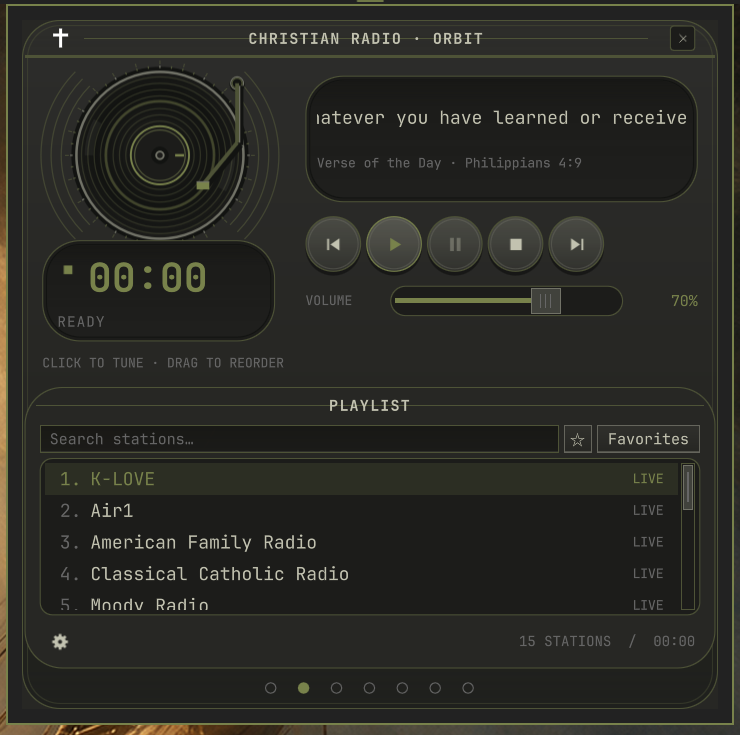

# Light

A Bible reader and Christian radio player for the Omarchy top bar.

## [Install Light →](INSTALL.md)

**[Open the installation page for the complete copy-and-paste terminal command.](INSTALL.md)**

## Get started

Requires Omarchy/Quickshell, Node.js 22.5+, npm, Qt 6 Multimedia 6.8+, `base-devel`, `pkgconf`, `curl`, `jq`, `wl-clipboard`, and `xdg-utils`.

Bible reading requires a YouVersion account and access to the YouVersion Platform API.

1. In the Light checkout, run `npm ci --prefix service`, then `./install.sh`.
2. Open Light from the top bar and sign in with YouVersion.
3. Choose a Bible version and start reading.

The installer enables the widget and starts `omarchy-light-public.service` on loopback port 8788. Every HTTP endpoint requires a random local client credential, rotated on daemon startup and stored in the owner-only `~/.config/omarchy/light-public/client-auth-header` file (0600 inside a 0700 directory). The widget reads this file directly; other local users cannot access the service using the daemon owner’s YouVersion session. If you override `LIGHT_CONFIG_DIR`, set the same value for the widget process. Light stores its data in `~/.config/omarchy/light-public/` and preserves existing LHT services and shortcuts. If a suggested shortcut is occupied, choose another in Settings.

### Install from the Omarchy plugin page

After installing the prerequisites above, copy this complete command into your terminal:

```bash
(omarchy plugin add https://github.com/whiteOvis/Light.git --yes && cd "$HOME/.config/omarchy/plugins/light.bible-reader" && npm ci --prefix service && ./install.sh)
```

This adds the repository without enabling it, installs the service dependencies, builds the native audio module, configures the local service, and enables Light only after setup succeeds. `--yes` accepts Omarchy's repository confirmation; each `&&` stops setup if the previous step fails.

The marketplace currently marks Light as **Manual setup** and suppresses its standard copy-install button because `omarchy plugin add ... --enable` alone cannot complete the required build and service setup. Use the complete command above instead.

To update an existing installation:

```bash
(omarchy plugin update light.bible-reader && cd "$HOME/.config/omarchy/plugins/light.bible-reader" && npm ci --prefix service && ./install.sh)
```

Keep the checkout: the service runs from it.

Type a reference or phrase to search. Click the faint book, chapter, or version inside the search box to browse.

Remove Light with `./uninstall.sh`. Your saved data remains on the device.

## Features

- Highlights, notes, bookmarks, and tabs.
- Offline reading where permitted by the selected version.
- Adjustable text, night mode, and optional Christian radio.
- Markdown exports for notes and bookmarks.

See **Settings → Shortcuts** for keyboard controls.

## Screenshots

[View all 14 screenshots](docs/SCREENSHOTS.md): reader, Verse of the Day, settings, downloads, shortcuts, and all seven radio layouts.

### Bible reader



### Christian radio



## Data and terms

Settings, notes, bookmarks, and encrypted sign-in data stay on your device. Bible requests and optional highlight sync use YouVersion.

Light ships without Bible text. Content availability and use follow [YouVersion’s API requirements](https://developers.youversion.com/api-usage) and publisher terms. Light is independent and is not endorsed by YouVersion.

[Privacy](https://www.bible.com/privacy) · [Terms](https://platform.youversion.com/?tos=1) · [MIT license](LICENSE) · [Third-party notices](THIRD_PARTY_NOTICES.md)
