# Light screenshot gallery

Actual screenshots captured on desktop 1, tightly framed around Light. All seven radio layouts use the active Omarchy theme.

## Bible reader

## Verse of the Day

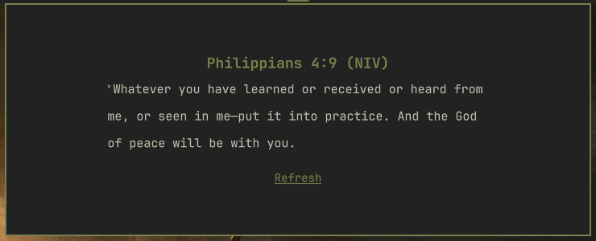

## Reading controls

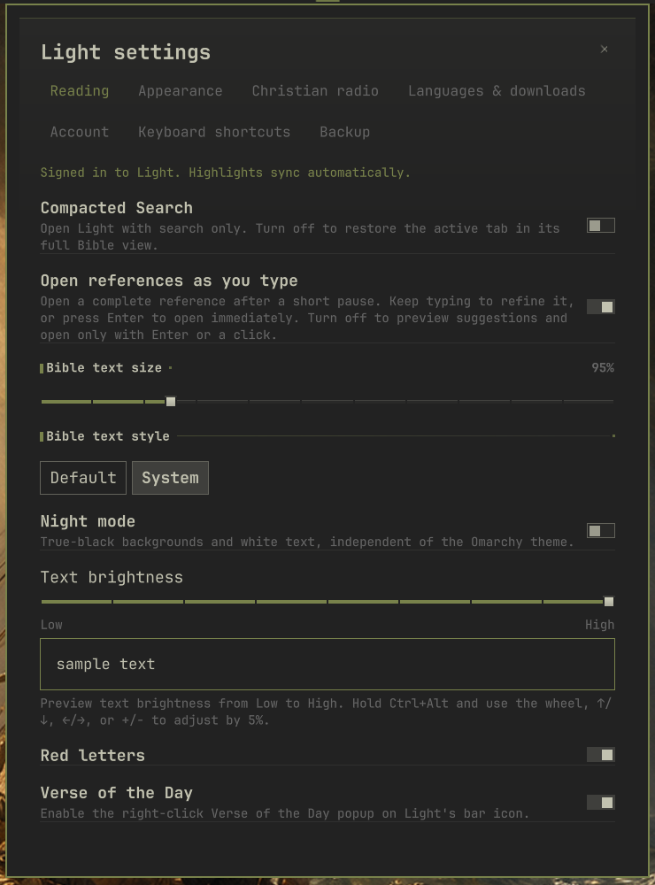

## Appearance

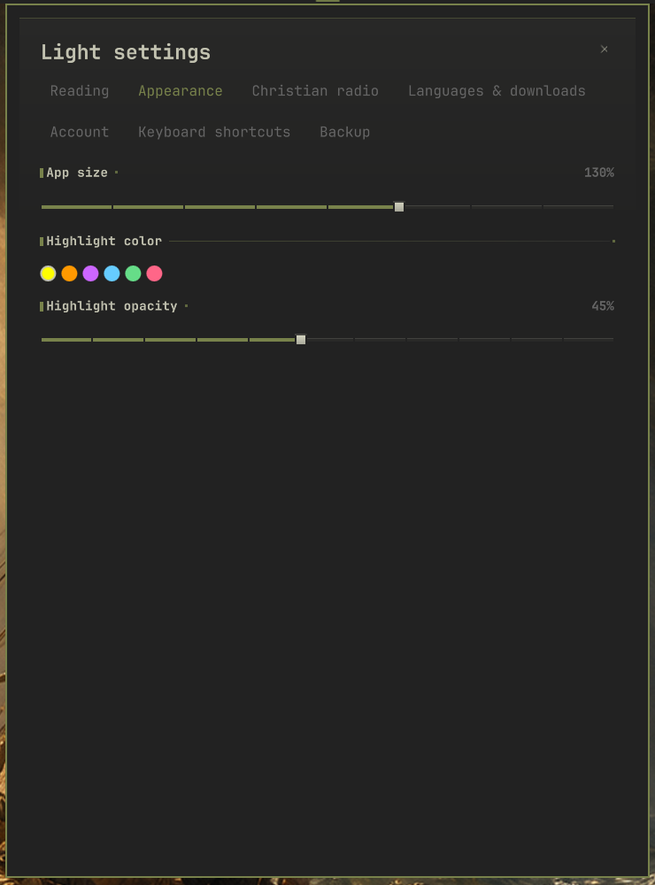

## Languages and offline downloads

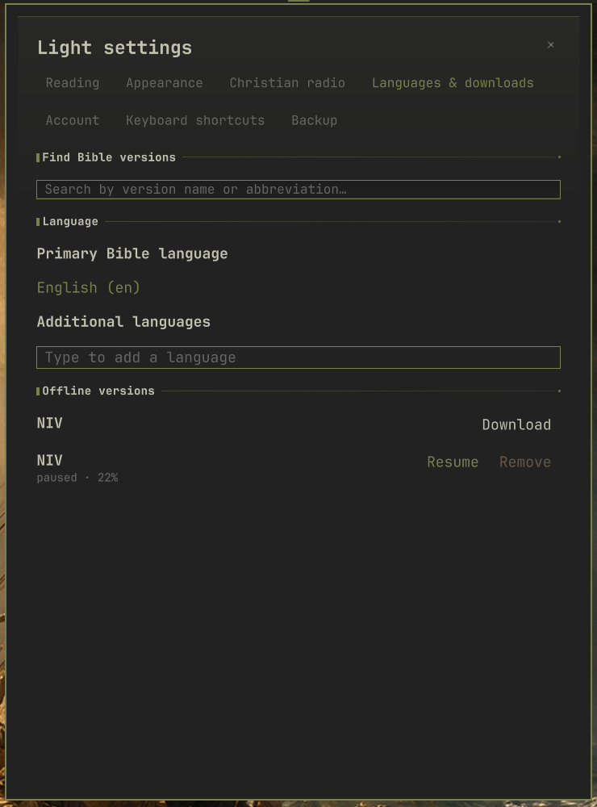

## Keyboard shortcuts

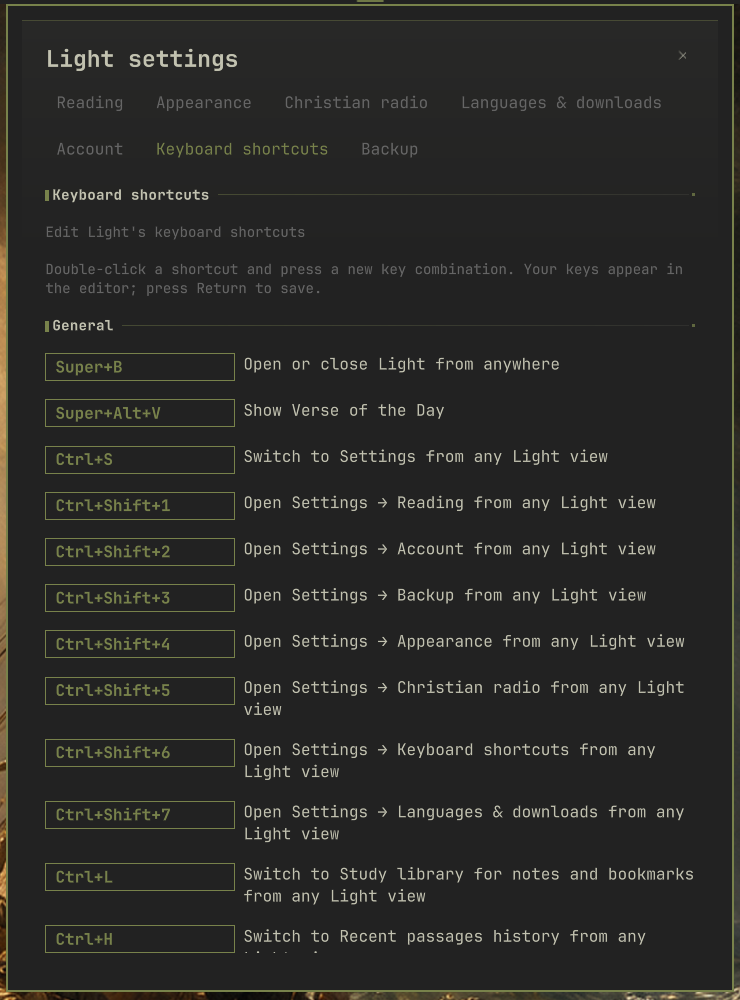

## Station management

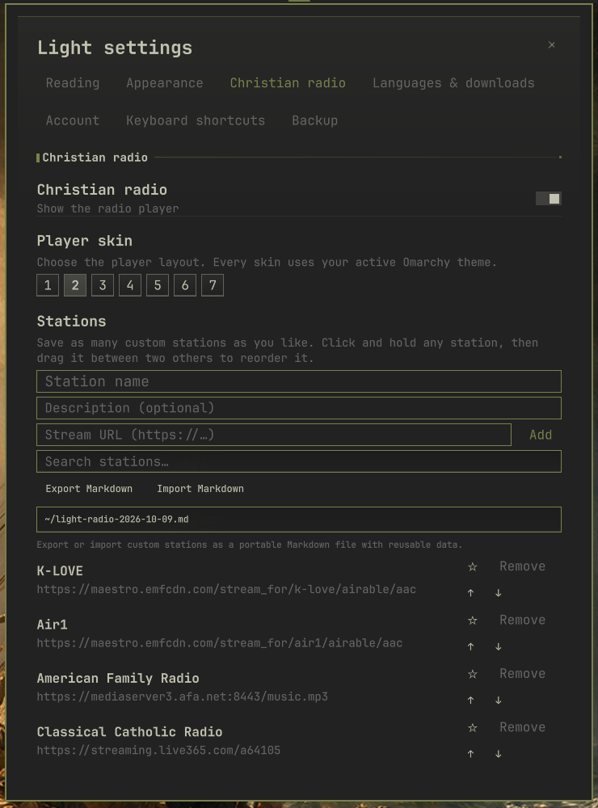

## Orbit radio

## Rack radio

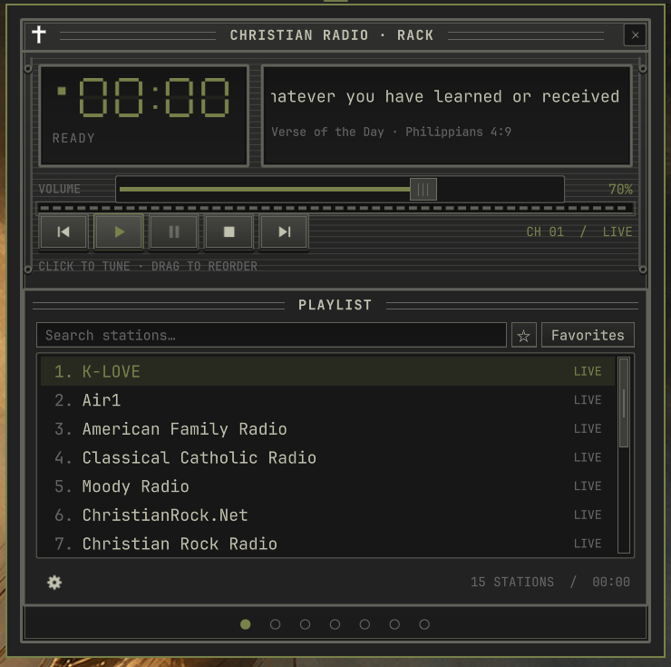

## Stomp radio

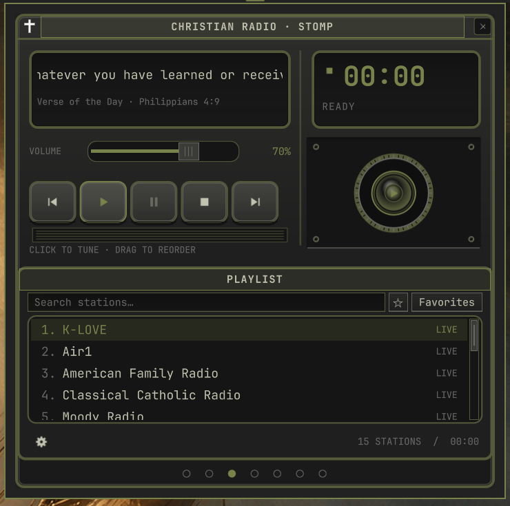

## Tape radio

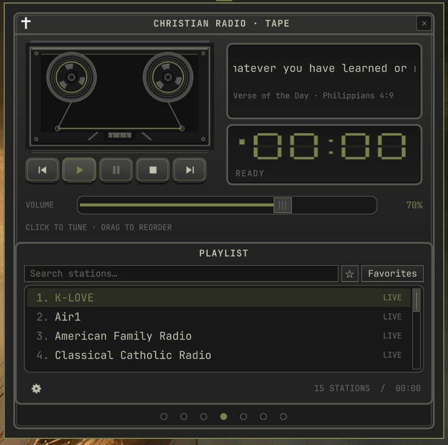

## Air radio

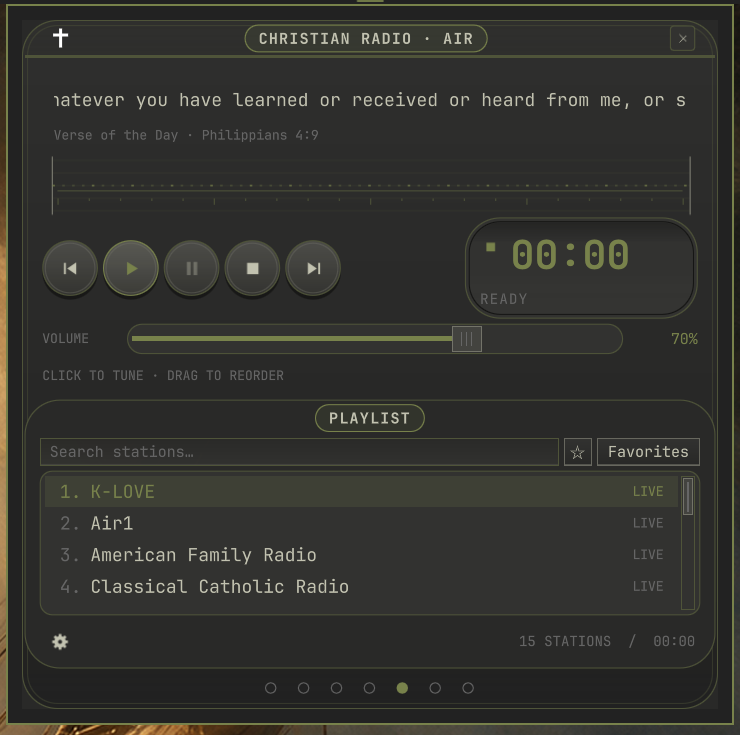

## Studio radio

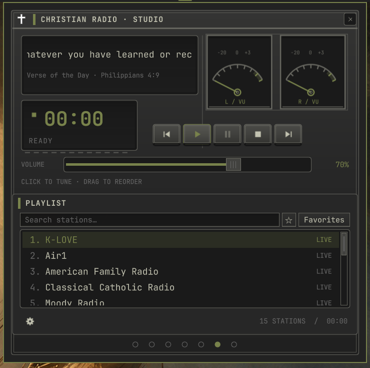

## Valve radio

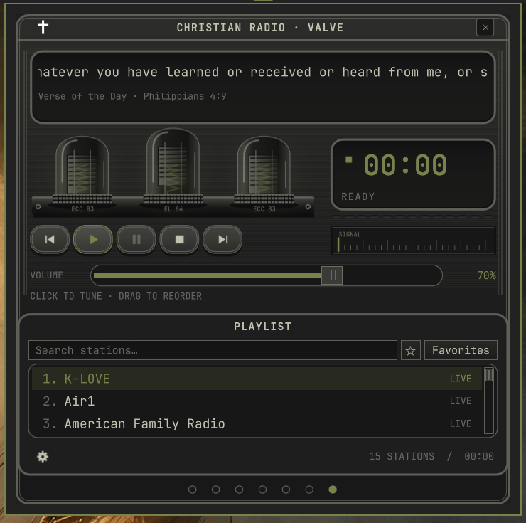

